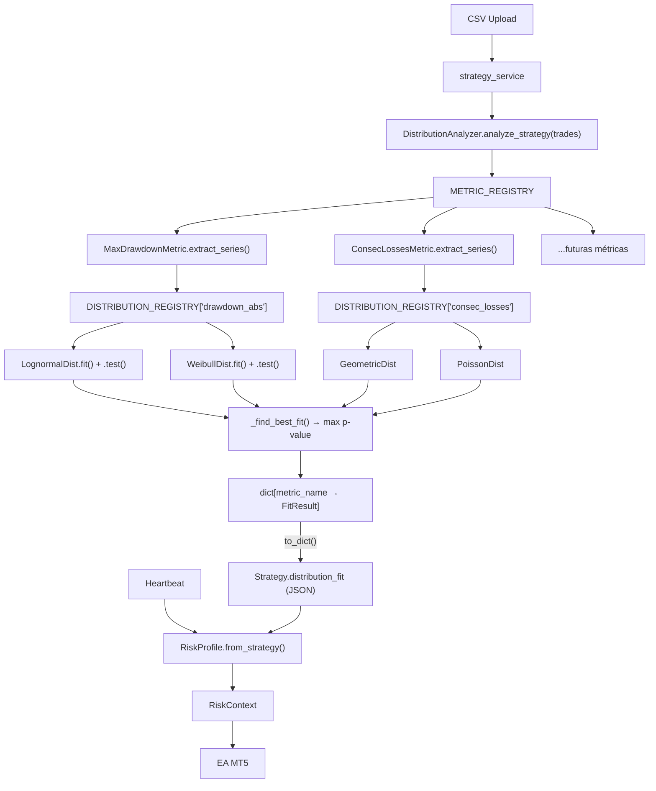

# IronRisk — Motor Estadístico · Plan Definitivo

---

## Estructura de carpetas

```
backend/services/
├── stats/                           ← NUEVO paquete estadístico
│   ├── __init__.py
│   │
│   ├── distributions/               ← Registry de distribuciones
│   │   ├── __init__.py              ← DISTRIBUTION_REGISTRY + @register
│   │   ├── pnl.py                   ← NormalDist, TStudentDist, LaplaceDist, LogisticDist
│   │   ├── drawdown.py              ← LognormalDist, WeibullDist
│   │   └── counts.py                ← GeometricDist, PoissonDist, NegBinomialDist
│   │
│   ├── metrics/                     ← Registry de métricas de riesgo
│   │   ├── __init__.py              ← METRIC_REGISTRY + @register_metric
│   │   ├── base.py                  ← RiskMetric (ABC)
│   │   ├── drawdown.py              ← MaxDrawdownMetric
│   │   ├── daily_loss.py            ← DailyLossMetric
│   │   ├── streaks.py               ← ConsecLossesMetric
│   │   └── stagnation.py            ← StagnationDaysMetric, StagnationTradesMetric
│   │
│   ├── analyzer.py                  ← DistributionAnalyzer (usa ambos registries)
│   ├── fit_result.py                ← FitResult dataclass
│   ├── risk_profile.py              ← RiskProfile, ShieldMode, StatisticalMode, RiskContext
│   ├── chart_renderer.py            ← ChartRenderer (matplotlib → BMP)
│   └── drift_tracker.py             ← ConjugateDriftTracker, BootstrapDriftTracker
```

---

## Arquitectura OOP Extensible

### Patrón 1: Registry de Distribuciones

Cada distribución es una clase que se **auto-registra** con un decorador:

```python
# distributions/__init__.py
DISTRIBUTION_REGISTRY: dict[str, list[type["DistributionCandidate"]]] = {
    "pnl_per_trade": [],
    "drawdown_abs": [],
    "consec_losses": [],
    "stagnation": [],
}

def register(variable: str):
    """Decorador: registra una distribución para una variable."""
    def decorator(cls):
        DISTRIBUTION_REGISTRY[variable].append(cls)
        return cls
    return decorator
```

```python
# distributions/pnl.py
from scipy import stats
from . import register

@register("pnl_per_trade")
class NormalDist:
    name = "Normal"
    scipy_dist = stats.norm
    
    @staticmethod
    def fit(data):
        return stats.norm.fit(data)
    
    @staticmethod
    def test(data, params):
        return stats.kstest(data, 'norm', params)

@register("pnl_per_trade")
class TStudentDist:
    name = "t-Student"
    scipy_dist = stats.t
    # ... mismo contrato

@register("pnl_per_trade")
class LaplaceDist:
    name = "Laplace"
    scipy_dist = stats.laplace

@register("pnl_per_trade")
class LogisticDist:
    name = "Logistic"
    scipy_dist = stats.logistic
```

> **Añadir distribución mañana** = crear clase + `@register("variable")`. Nada más.

### Patrón 2: Registry de Métricas de Riesgo

Cada métrica se auto-registra igualmente:

```python
# metrics/base.py
from abc import ABC, abstractmethod
import numpy as np

METRIC_REGISTRY: list[type["RiskMetric"]] = []

def register_metric(cls):
    METRIC_REGISTRY.append(cls)
    return cls

class RiskMetric(ABC):
    """Contrato que toda métrica debe cumplir."""
    name: str           # "max_drawdown"
    label: str          # "Max DD"
    variable: str       # clave en DISTRIBUTION_REGISTRY → qué distribuciones probar
    
    @abstractmethod
    def extract_series(self, trades: list[dict]) -> np.ndarray:
        """Extrae la serie numérica del backtest para ajuste."""
    
    @abstractmethod
    def compute_current(self, equity_curve: list[float]) -> float:
        """Calcula el valor actual (para el heartbeat)."""
```

```python
# metrics/drawdown.py
@register_metric
class MaxDrawdownMetric(RiskMetric):
    name = "max_drawdown"
    label = "Max DD"
    variable = "drawdown_abs"     # ← prueba lognormal + weibull
    
    def extract_series(self, trades):
        # calcula DD running del backtest → array de DDs
    
    def compute_current(self, equity_curve):
        # peak - current

# metrics/streaks.py
@register_metric
class ConsecLossesMetric(RiskMetric):
    name = "consec_losses"
    label = "Consec. Losses"
    variable = "consec_losses"    # ← prueba geométrica + poisson + nbinom
    
    def extract_series(self, trades):
        # longitudes de rachas perdedoras del backtest
```

> **Añadir métrica mañana** = crear clase + `@register_metric` + indicar qué variable (= qué distribuciones probar).

### Cómo el Analyzer conecta todo

```python
# analyzer.py
from .distributions import DISTRIBUTION_REGISTRY
from .metrics.base import METRIC_REGISTRY

class DistributionAnalyzer:
    """No conoce ninguna métrica ni distribución por nombre.
    Solo recorre los registries."""
    
    def analyze_strategy(self, trades: list[dict]) -> dict[str, FitResult]:
        results = {}
        for MetricClass in METRIC_REGISTRY:
            metric = MetricClass()
            series = metric.extract_series(trades)
            
            if len(series) < 20:
                results[metric.name] = FitResult.empty(metric.name)
                continue
            
            # Buscar distribuciones registradas para esta variable
            candidates = DISTRIBUTION_REGISTRY.get(metric.variable, [])
            best = self._find_best_fit(series, candidates)
            results[metric.name] = best
        
        return results  # {"max_drawdown": FitResult(...), "consec_losses": FitResult(...)}
    
    def _find_best_fit(self, data, candidates) -> FitResult:
        best = None
        for DistClass in candidates:
            params = DistClass.fit(data)
            stat, p_value = DistClass.test(data, params)
            if p_value > 0.05 and (best is None or p_value > best.p_value):
                best = FitResult(DistClass.name, params, p_value, passed=True)
        return best or FitResult("empirical", passed=False, raw_data=data)
```

### Ejemplo: añadir nueva métrica + distribución

```python
# PASO 1: Invento métrica "Max Adverse Excursion"
# metrics/mae.py
@register_metric
class MaxAdverseExcursionMetric(RiskMetric):
    name = "max_adverse_excursion"
    label = "MAE"
    variable = "drawdown_abs"  # reutiliza distribuciones de DD
    
    def extract_series(self, trades):
        return np.array([t["mae"] for t in trades])

# PASO 2: Quiero probar también la Cauchy para PnL
# distributions/pnl.py (añado al final)
@register("pnl_per_trade")
class CauchyDist:
    name = "Cauchy"
    scipy_dist = stats.cauchy
    @staticmethod
    def fit(data): return stats.cauchy.fit(data)
    @staticmethod
    def test(data, params): return stats.kstest(data, 'cauchy', params)

# CERO líneas modificadas en analyzer.py, risk_profile.py, ni en ningún otro sitio.
```

### Diagrama de flujo completo



---

## FitResult

```python
@dataclass(frozen=True)
class FitResult:
    distribution_name: str     # "t-Student" o "empirical"
    metric_name: str           # "max_drawdown"
    params: tuple              # parámetros scipy
    p_value: float             # p-value del KS test
    passed: bool               # p_value > 0.05
    raw_data: np.ndarray       # datos originales (para empírico)
    
    def percentile(self, value: float) -> int:
        if self.passed:
            dist = getattr(stats, self.distribution_name)
            return int(dist.cdf(value, *self.params) * 100)
        return int(np.searchsorted(np.sort(self.raw_data), value) / len(self.raw_data) * 100)
    
    def to_dict(self) -> dict: ...
    
    @classmethod
    def from_dict(cls, d: dict) -> "FitResult": ...
    
    @classmethod
    def empty(cls, metric_name: str) -> "FitResult":
        return cls(metric_name=metric_name, distribution_name="none",
                   passed=False, p_value=0, params=(), raw_data=np.array([]))
```

---

## RiskProfile + Modos

```python
class RiskProfile:
    @classmethod
    def from_strategy(cls, strategy) -> "RiskProfile":
        fits = strategy.distribution_fit or {}
        has_valid_fit = any(f.get("passed") for f in fits.values())
        if has_valid_fit:
            return cls(mode=StatisticalMode(fits=fits))
        return cls(mode=ShieldMode(limits=strategy.risk_config))

class ShieldMode:
    """Sin datos → solo % del límite."""
    def get_context(self, metric_name, current, limit):
        pct_used = (current / limit * 100) if limit > 0 else 0
        color = "green" if pct_used < 60 else "yellow" if pct_used < 85 else "red"
        return RiskContext(percentile=None, label=f"{pct_used:.0f}% of limit", color=color)

class StatisticalMode:
    """Con backtest → percentil real."""
    def get_context(self, metric_name, current):
        fit = FitResult.from_dict(self.fits[metric_name])
        pct = fit.percentile(current)
        if pct <= 50:   label, color = f"percentile {pct} — expected range", "green"
        elif pct <= 80: label, color = f"percentile {pct} — elevated", "yellow"
        else:           label, color = f"percentile {pct} — extreme", "red"
        return RiskContext(percentile=pct, label=label, color=color)
```

---

## DriftTracker (Fase 5 · Premium)

```python
# drift_tracker.py
class DriftTracker:
    """Elige conjugate o bootstrap según distribución."""
    
    @staticmethod
    def create(fit: FitResult, backtest_trades):
        if fit.distribution_name == "Normal":
            return ConjugateDriftTracker(
                prior_mean=np.mean(backtest_trades),
                prior_std=np.std(backtest_trades),
                prior_n=len(backtest_trades))
        return BootstrapDriftTracker(backtest_mean=np.mean(backtest_trades))

class ConjugateDriftTracker:
    """Normal-Normal conjugate. Microsegundos."""
    # ... (fórmulas cerradas)

class BootstrapDriftTracker:
    """Resampleo 10K. ~50ms. Sin asunciones."""
    # ... (np.random.choice con reemplazo)
```

---

## Fases

| Fase | Qué | Prioridad | Tier |
|---|---|---|---|
| **0** | Entorno: venv + `pip install scipy matplotlib` | 🔴 P0 | — |
| **1** | `stats/` package: registries + distribuciones + métricas + analyzer + FitResult | 🔴 P0 | Free |
| **2** | `RiskProfile` (Shield/Statistical) + `RiskContext` | 🔴 P0 | Free |
| **3** | Heartbeat con `risk_context` + badge EA | 🟡 P1 | Free |
| **4** | **Backend-Driven UI** (Config JSON en Web → Motor Render MQL5) | 🟡 P1 | Premium |
| **5** | **PnL como Métrica Integral** (Modelado completo Backend → Motor UI Web/EA) | 🟡 P1 | Premium |
| **6** | `RealTrade` sync + `DriftTracker` (Teorema de Bayes: conjugate/bootstrap) | 🟢 P2 | Premium |

> [!IMPORTANT]
> ### Fase 6 — Frontera Bayesiana: `start_date`
> 
> El campo `start_date` de cada estrategia es la **frontera temporal** que separa los dos mundos:
> 
> - **Trades con `close_time <  start_date`** → **Prior** (backtest/historial importado)
> - **Trades con `close_time >= start_date`** → **Evidencia nueva** (live, para actualización Bayesiana)
> 
> **¿Por qué es crítico?**
> 
> Un usuario puede exportar su historial real de operaciones manuales como CSV e importarlo como "backtest".
> Cuando activa el EA, esas mismas operaciones empiezan a llegar como `RealTrade`. Sin `start_date`:
> - El DriftTracker contaría operaciones **dos veces** (como prior Y como evidencia)
> - La posterior Bayesiana estaría contaminada
> - Los percentiles y alertas de riesgo serían incorrectos
> 
> **Valor por defecto:** fecha del último trade del CSV importado (el parser la extrae automáticamente).
> Esto garantiza que solo las operaciones **posteriores** a la importación se traten como evidencia nueva.
> 
> **Editable:** El usuario puede ajustar `start_date` manualmente si importó datos parciales
> o si quiere redefinir dónde empieza el "live".

*Nota: La Fase 5 requiere estandarizar la Esperanza Matemática (PnL) como métrica de riesgo que pase por la evaluación estadística y envíe JSON al EA de la misma forma que el Max Drawdown, preparando el terreno antes de construir el DriftTracker en la Fase 6.*

## Archivos

| Archivo | Acción | Fase |
|---|---|---|
| `services/stats/__init__.py` | NEW | 1 |
| `services/stats/distributions/__init__.py` | NEW — registry | 1 |
| `services/stats/distributions/pnl.py` | NEW — Normal, t, Laplace, Logistic | 1 |
| `services/stats/distributions/drawdown.py` | NEW — Lognormal, Weibull | 1 |
| `services/stats/distributions/counts.py` | NEW — Geometric, Poisson, NegBinom | 1 |
| `services/stats/metrics/__init__.py` | NEW — registry | 1 |
| `services/stats/metrics/base.py` | NEW — RiskMetric ABC | 1 |
| `services/stats/metrics/drawdown.py` | NEW — MaxDrawdownMetric | 1 |
| `services/stats/metrics/daily_loss.py` | NEW — DailyLossMetric | 1 |
| `services/stats/metrics/streaks.py` | NEW — ConsecLossesMetric | 1 |
| `services/stats/metrics/stagnation.py` | NEW — StagnationDays/Trades | 1 |
| `services/stats/analyzer.py` | NEW — DistributionAnalyzer | 1 |
| `services/stats/fit_result.py` | NEW — FitResult dataclass | 1 |
| `models/strategy.py` | MODIFY (+distribution_fit) | 1 |
| `services/strategy_service.py` | MODIFY (call analyzer) | 1 |
| `services/stats/risk_profile.py` | NEW | 2 |
| `api/live.py` | MODIFY (+risk_context) | 3 |
| `EA .mq5` | MODIFY (badge) | 3 |
| `api/live.py` | MODIFY (+ endpoint `/layout_config` JSON) | 4 |
| `Dashboard (webapp)` | MODIFY (Configurador visual de widgets/tarjetas) | 4 |
| `EA .mq5` | MODIFY (Añadir Parseador JSON y Motor Gráfico Dinámico) | 4 |
| `services/stats/metrics/pnl.py` | NEW — ExpectedPayoffMetric | 5 |
| `services/stats/distributions/pnl.py` | MODIFY — Ajustar distribuciones para PnL Metric | 5 |
| `Dashboard (webapp)` | MODIFY — Tarjeta PnL como Riesgo Estándar | 5 |
| `EA .mq5` | MODIFY — Evaluar PnL en el Motor JSON | 5 |
| `models/real_trade.py` | NEW | 6 |
| `services/stats/drift_tracker.py` | NEW | 6 |
| `api/strategies.py` | MODIFY (+sync endpoint) | 6 |
| `EA .mq5` | MODIFY (sync live trades) | 6 |

> [!IMPORTANT]
> **Dependencias**: `scipy`, `matplotlib`, `numpy`. Instalar en venv antes de empezar.
